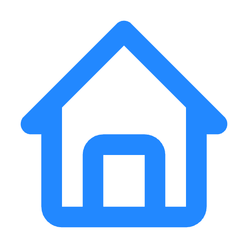

<div align="center">
  
  
  # BuildEstate

  ### Premium Real Estate Platform with AI-Powered Insights & Seamless Animations
  
  [](https://reactjs.org/)
  [](https://nodejs.org/)
  [](https://www.mongodb.com/)
  [](https://tailwindcss.com/)
  [](https://www.framer.com/motion/)
</div>

<p align="center">
  <a href="#overview">Overview</a> •
  <a href="#features">Features</a> •
  <a href="#tech-stack">Tech Stack</a> •
  <a href="#getting-started">Getting Started</a> •
  <a href="#app-structure">App Structure</a> •
  <a href="#screenshots">Screenshots</a> •
  <a href="#animations">Animations</a> •
  <a href="#contributing">Contributing</a>
</p>

<div align="center">
  
</div>

## 📋 Overview

BuildEstate is a comprehensive real estate platform built with the MERN stack that provides advanced property search capabilities, AI-powered market insights, and a complete property management system. The platform helps users find their ideal properties while providing valuable investment analysis through cutting-edge AI technology.

With modern UI animations and transitions powered by Framer Motion, BuildEstate delivers a premium user experience that feels responsive, intuitive, and delightful to use.

## ✨ Features

<details>
  <summary><b>🏠 User Features</b></summary>
  <br>
  
  - **🔍 Advanced Property Search** — Filter properties by location, price range, amenities, and property type
  - **🏙️ Virtual Property Tours** — Detailed property listings with high-quality images and comprehensive information
  - **🔐 User Authentication** — Secure registration and login with JWT
  - **📅 Appointment Scheduling** — Book and manage property viewings with email notifications
  - **❤️ Favorites System** — Save properties for later viewing with animated interactions
  - **📱 Responsive Design** — Fully optimized for all devices with smooth transitions between viewport sizes
</details>

<details>
  <summary><b>🤖 AI-Powered Features</b></summary>
  <br>

  - **🎯 Smart Property Recommendations** — AI-powered search that finds properties matching specific requirements
  - **📊 Location Trend Analysis** — Visualizes market trends, rental yields, and property appreciation rates
  - **💰 Investment Insights** — AI-generated recommendations for different areas with dynamic data visualization
  - **⚡ Real-time Property Analysis** — Backend services fetch and analyze property data with animated chart transitions
</details>

<details>
  <summary><b>👩‍💼 Admin Features</b></summary>
  <br>

  - **📈 Dashboard Analytics** — Comprehensive statistics on properties, users, and platform metrics with animated charts
  - **🏘️ Property Management** — Add, edit, and delete property listings with smooth CRUD transitions
  - **🗓️ Appointment Management** — Handle viewing requests and update appointment status with visual feedback
  - **👥 User Management** — Track user activity and manage accounts with interactive data tables
</details>

<details>
  <summary><b>🎭 Animation Features</b></summary>
  <br>

  - **✨ Micro-interactions** — Subtle feedback animations for user actions
  - **🔄 Page Transitions** — Smooth transitions between pages for a native app-like feel
  - **📊 Chart Animations** — Data visualization with progressive reveal animations
  - **🖼️ Image Gallery** — Animated property image carousels with zoom capabilities
  - **🔔 Notification System** — Animated toast notifications for user feedback
  - **🌓 Theme Switching** — Animated dark/light mode transitions
</details>

## 🛠️ Tech Stack

### Frontend


### Backend


### AI Integration


## 🚀 Getting Started

### Prerequisites
- Node.js (v16+)
- npm or yarn
- MongoDB instance (local or Atlas)
- API keys for AI services

### Installation

<details>
<summary><b>Step 1: Clone the repository</b></summary>

```bash
git clone https://github.com/AAYUSH412/Real-Estate-Website.git
cd Real-Estate-Website
```
</details>

<details>
<summary><b>Step 2: Setup environment variables</b></summary>

Create `.env` files in the backend, frontend, and admin directories as follows:

**Backend (.env)**
```
PORT=4000
MONGODB_URI=your_mongodb_connection_string
JWT_SECRET=your_jwt_secret
EMAIL=your_email_for_sending_notifications
PASSWORD=your_email_password
AZURE_API_KEY=your_azure_ai_key
```

**Frontend (.env.local)**
```
VITE_BACKEND_URL=http://localhost:4000
```

**Admin (.env.local)**
```
VITE_BACKEND_URL=http://localhost:4000
```
</details>

<details>
<summary><b>Step 3: Install dependencies</b></summary>

```bash
# Backend dependencies
cd backend
npm install

# Frontend dependencies
cd ../frontend
npm install

# Admin dependencies
cd ../admin
npm install
```
</details>

<details>
<summary><b>Step 4: Run the development servers</b></summary>

```bash
# Run backend server
cd backend
npm run dev

# Run frontend app (in a new terminal)
cd frontend
npm run dev

# Run admin app (in a new terminal)
cd admin
npm run dev
```
</details>

<details>
<summary><b>Step 5: Access the applications</b></summary>

- 🌐 Frontend: [http://localhost:5173](http://localhost:5173)
- 👩‍💼 Admin Panel: [http://localhost:5174](http://localhost:5174)
- ⚙️ Backend API: [http://localhost:4000](http://localhost:4000)
</details>

<details>
<summary><b>Step 6: Docker support (optional)</b></summary>

```bash
# Run with Docker Compose
docker-compose up
```

This will start the backend service. You can modify the docker-compose.yml file to include frontend and admin services as needed.
</details>

## 📱 App Structure

```
project/
├── admin/                 # Admin dashboard React app
│   ├── src/               # Admin source code
│   │   ├── components/    # UI components with animations
│   │   └── pages/         # Admin dashboard pages
├── backend/               # Express server and API
│   ├── config/            # Server configuration
│   ├── controller/        # Request handlers
│   ├── middleware/        # Express middleware
│   ├── models/            # Mongoose schemas
│   ├── routes/            # API routes
│   ├── services/          # External service integrations
│   └── server.js          # Main server file
└── frontend/              # User-facing React app
    ├── public/            # Static assets
    └── src/
        ├── assets/        # Images and static resources
        ├── components/    # Reusable UI components with animations
        ├── context/       # React context providers
        ├── pages/         # Main page components
        ├── animations/    # Animation utilities and configurations
        └── utils/         # Helper functions
```

## 🖼️ Screenshots

### Home Page with Animated Elements


### Property Listings with Smooth Transitions


### Property Details with Interactive Gallery


### AI-Powered Property Analysis with Animated Charts


### AI-Powered Location Trends with Data Visualization


## 🎬 Animations

BuildEstate features a variety of carefully designed animations that enhance the user experience without being distracting:

### Page Transitions
- Smooth fade transitions between pages
- Page elements that animate into position on load
- Exit animations for a polished feel

### UI Micro-interactions
- Button hover and active states
- Form field focus animations
- Loading indicators and spinners

### Content Animations
- Property card reveal animations
- Staggered animation for list items
- Parallax scrolling effects on the home page

### Data Visualizations
- Progressive chart animations
- Tooltip reveal animations
- Counter animations for statistics

All animations are implemented using Framer Motion with performance optimization in mind, ensuring smooth experiences even on mobile devices.

## 🤝 Contributing

<details>
<summary><b>How to contribute</b></summary>
<br>

Contributions are welcome! Please follow these steps:

1. Fork the repository
2. Create your feature branch (`git checkout -b feature/amazing-feature`)
3. Commit your changes (`git commit -m 'Add some amazing feature'`)
4. Push to the branch (`git push origin feature/amazing-feature`)
5. Open a Pull Request

See the [CONTRIBUTING.md](CONTRIBUTING.md) file for more details.
</details>

## 📝 License

This project is licensed under the MIT License - see the [LICENSE](LICENSE) file for details.

## 🙏 Acknowledgements

<div align="center">
  
[](https://reactjs.org/)
[](https://expressjs.com/)
[](https://www.mongodb.com/)
[](https://tailwindcss.com/)
[](https://www.framer.com/motion/)
[](https://lucide.dev/)
[](https://azure.microsoft.com/en-us/services/cognitive-services/ai-services/)
  
</div>

## 📧 Contact

Aayush Vaghela - [GitHub](https://github.com/AAYUSH412)

Project Link: [https://github.com/AAYUSH412/Real-Estate-Website](https://github.com/AAYUSH412/Real-Estate-Website)

---

<div align="center">
  <p>Built with ❤️ by Aayush Vaghela</p>
  <p>© 2025 BuildEstate. All Rights Reserved.</p>
</div>
